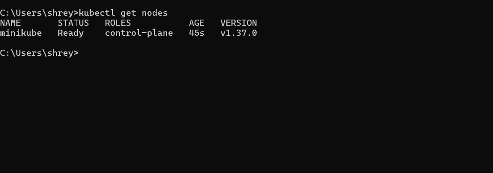
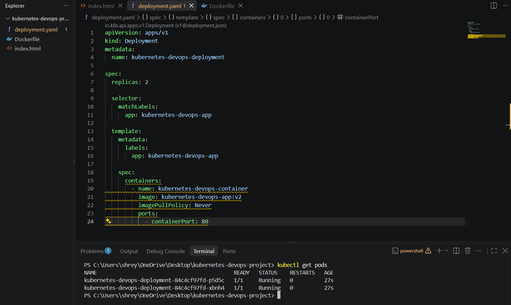
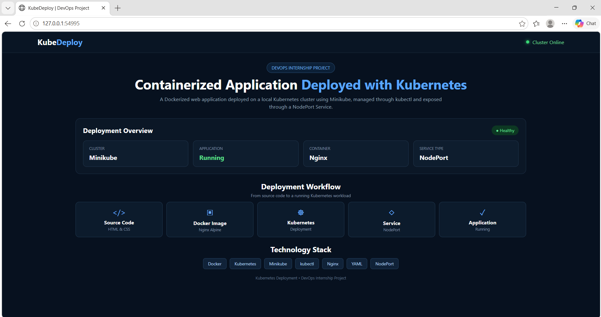
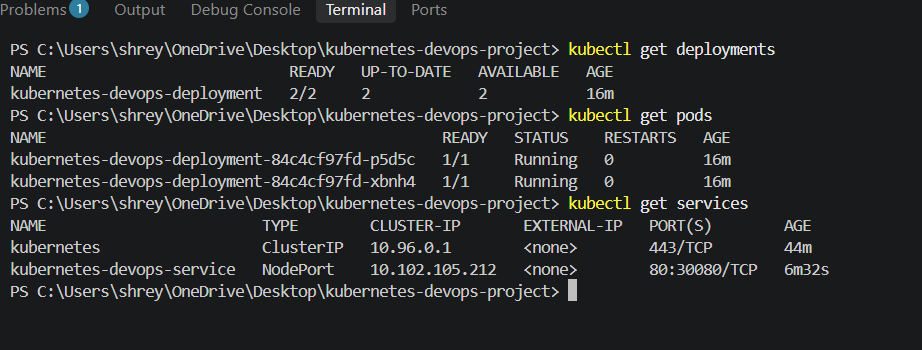

# ☸️ Kubernetes DevOps Project

A Dockerized web application deployed on a local Kubernetes cluster using **Docker, Kubernetes, Minikube, kubectl, Deployments, Pods, and NodePort Service**.

---

## 📌 Project Overview

This project demonstrates how a web application can be containerized using Docker and deployed on a Kubernetes cluster.

The application runs inside Docker containers managed by Kubernetes. Minikube is used to create the local Kubernetes cluster, while a NodePort Service is used to expose and access the application from the browser.

---

## 🛠️ Technologies Used

- HTML
- Docker
- Nginx
- Kubernetes
- Minikube
- kubectl
- YAML
- Git
- GitHub
- Visual Studio Code

---

## 📂 Project Structure

```text
kubernetes-devops-project/
│
├── Dockerfile
├── index.html
├── deployment.yaml
├── service.yaml
├── README.md
│
└── Documents/
    └── Documents/
        ├── 01-kunernetes-cluster-ready.png
        ├── 02-kubernetes-pods-running.png
        ├── 03-kubernetes-application-running.png
        └── 04-kubernetes-final-status.png
```

---

## 🐳 Docker Containerization

The web application is packaged inside a Docker container.

The **Dockerfile** uses Nginx as the web server and copies the `index.html` file into the Nginx web directory.

Docker helps package the application and its required environment into a container so that the application can run consistently.

---

## ☸️ Kubernetes Deployment

Kubernetes is used to deploy and manage the Dockerized application.

The `deployment.yaml` file defines the Kubernetes Deployment and includes:

- Container image
- Container port
- Number of replicas
- CPU requests and limits
- Memory requests and limits

The application uses **2 replicas**, which means Kubernetes maintains two Pods running the application.

---

## 🌐 Kubernetes Service

The `service.yaml` file creates a **NodePort Service**.

The NodePort Service exposes the application outside the Kubernetes cluster and allows the application to be accessed through the browser.

### Application Architecture

```text
User
  ↓
Web Browser
  ↓
NodePort Service
  ↓
Kubernetes Deployment
  ↓
2 Replica Pods
  ↓
Docker Containers
  ↓
Nginx Web Server
  ↓
Web Application
```

---

## 🚀 Deployment Steps

### 1. Start Minikube

```bash
minikube start --driver=docker
```

### 2. Check Kubernetes Cluster

```bash
kubectl get nodes
```

### 3. Apply Kubernetes Deployment

```bash
kubectl apply -f deployment.yaml
```

### 4. Check Running Pods

```bash
kubectl get pods
```

### 5. Create Kubernetes Service

```bash
kubectl apply -f service.yaml
```

### 6. Check Kubernetes Services

```bash
kubectl get services
```

### 7. Open the Application

```bash
minikube service kubernetes-devops-service
```

---

# 📸 Project Screenshots

## 1️⃣ Kubernetes Cluster Ready

The Minikube Kubernetes cluster was successfully created and the Kubernetes control plane became ready.



---

## 2️⃣ Kubernetes Pods Running

The application was deployed with **2 replicas**.

Both Kubernetes Pods are successfully running with **READY 1/1** status.



---

## 3️⃣ Application Running on Kubernetes

The Dockerized web application was successfully deployed on Kubernetes and accessed through the NodePort Service.



---

## 4️⃣ Final Kubernetes Deployment Status

The final status verifies that the Kubernetes Pods, Deployment, and Service are running successfully.



---

## 🔄 DevOps Workflow

```text
HTML Web Application
        ↓
Docker Image
        ↓
Kubernetes Deployment
        ↓
2 Replica Pods
        ↓
NodePort Service
        ↓
Browser Access
```

---

## ✨ Key Features

- Dockerized web application
- Nginx web server
- Local Kubernetes cluster using Minikube
- Kubernetes Deployment
- 2 application replicas
- Kubernetes Pods
- NodePort Service
- CPU and memory resource configuration
- Kubernetes YAML configuration
- Container orchestration
- Application accessible through a web browser

---

## 📚 What I Learned

Through this project, I gained practical experience with:

- Creating a Dockerfile
- Building Docker images
- Running Docker containers
- Creating a local Kubernetes cluster using Minikube
- Deploying an application using Kubernetes
- Understanding Kubernetes Pods
- Creating Kubernetes Deployments
- Running multiple application replicas
- Creating Kubernetes Services
- Using NodePort to expose an application
- Writing Kubernetes YAML configuration files
- Using kubectl commands
- Configuring CPU and memory resources
- Managing a containerized application

---

## 🎯 Project Objective

The main objective of this project is to understand how **Docker and Kubernetes work together in a DevOps environment**.

Docker is used to containerize the web application, while Kubernetes is used to deploy, manage, and expose those containers.

---

## 👨‍💻 Author

**Shreyansh Singh**

## ✅ Project Status

- ✅ Docker Image Created
- ✅ Minikube Cluster Created
- ✅ Kubernetes Deployment Created
- ✅ 2 Replica Pods Running
- ✅ NodePort Service Created
- ✅ CPU & Memory Resources Configured
- ✅ Application Successfully Deployed
- ✅ Application Successfully Accessible
